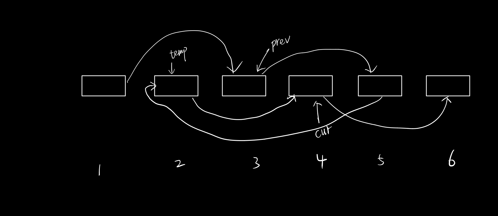

| title                | cr_date                              | labels     | updated                              |
| -------------------- | ------------------------------------ | ---------- | ------------------------------------ |
| Odd Even Linked List | 2021年 01月 22日 星期五 22:38:47 CST | LinkedList | 2021年 01月 22日 星期五 22:38:47 CST |

## Leetcode

[linked-list](https://leetcode.com/explore/learn/card/linked-list/219/classic-problems/1208/)  

## Question

Given a singly linked list, group all odd nodes together followed by the even nodes. Please note here we are talking about the node number and not the value in the nodes.（奇偶链表问题，将链表中奇数位置的节点移到偶数位置的前面）

**Example:**

```
Input: 1->2->3->4->5->NULL
Output: 1->3->5->2->4->NULL
```


**Constraints:**

- The relative order inside both the even and odd groups should remain as it was in the input.
- The first node is considered odd, the second node even and so on ...
- The length of the linked list is between `[0, 10^4]`.

## 解题思路

这道题我们可以设置两个指针，`prev`指向奇数位置节点，`cur`指向偶数位置节点，然后把cur节点的下一个节点移动到prev节点的后一个，然后cur和prev各向后进一格，现在prev和cur又分别指向了奇数和偶数节点了。

## 图




## Java Code

```java
/**
 * Definition for singly-linked list.
 * public class ListNode {
 *     int val;
 *     ListNode next;
 *     ListNode() {}
 *     ListNode(int val) { this.val = val; }
 *     ListNode(int val, ListNode next) { this.val = val; this.next = next; }
 * }
 */
class Solution {
    public ListNode oddEvenList(ListNode head) {
        if(head == null || head.next == null) return head;
        ListNode prev = head;
        ListNode cur = head.next;
        while(cur != null && cur.next != null){
            ListNode temp = prev.next;
            prev.next = cur.next;
            cur.next = cur.next.next;
            prev.next.next = temp;
            prev = prev.next;
            cur = cur.next;
        }
        return head;
    }
}
```


