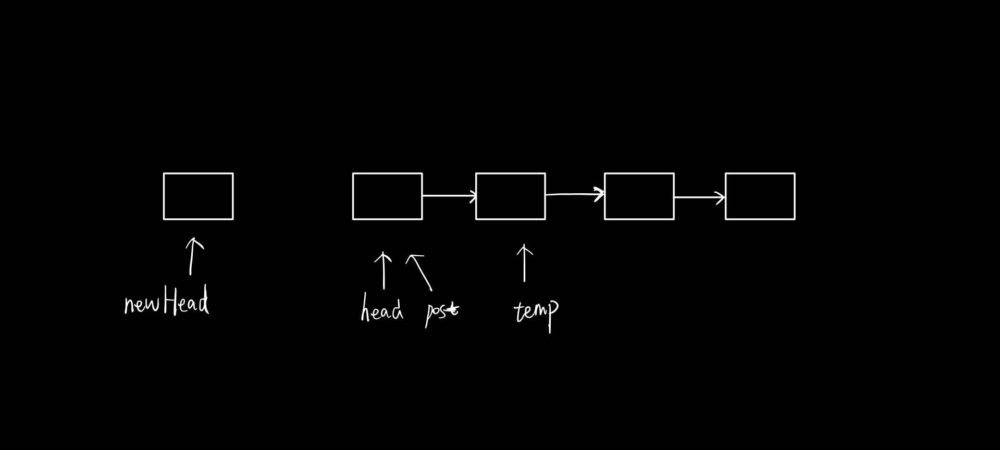
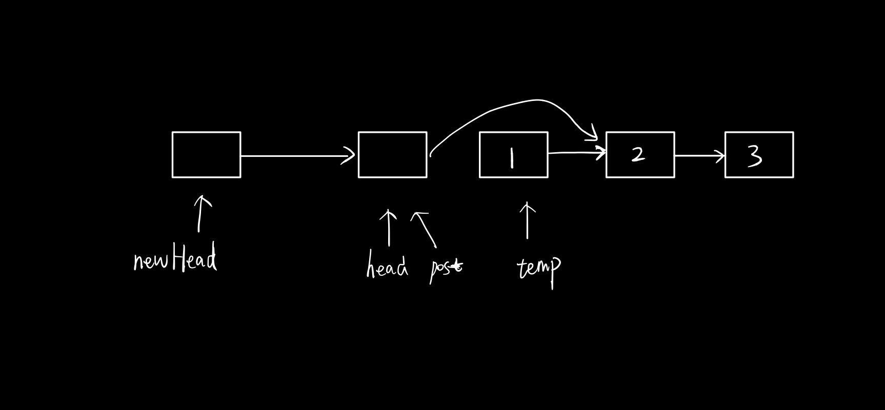
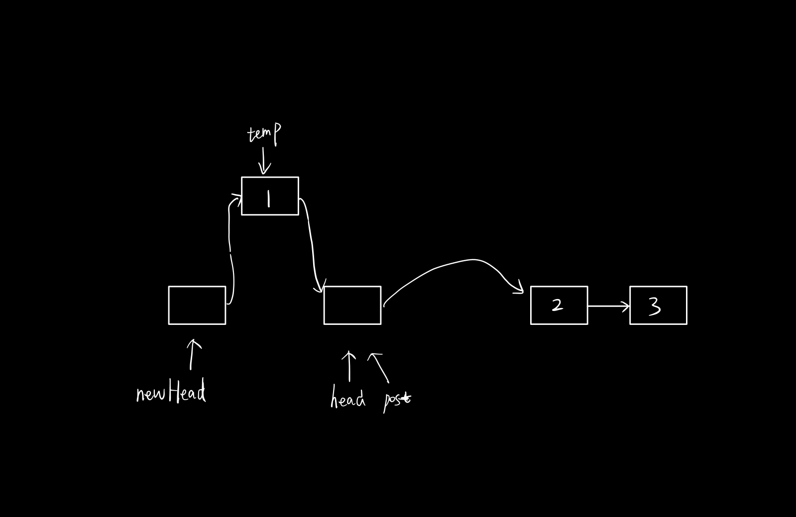

| title               | cr_date                              | labels     | updated                              |
| ------------------- | ------------------------------------ | ---------- | ------------------------------------ |
| Reverse Linked List | 2021年 01月 20日 星期三 23:04:04 CST | LinkedList | 2021年 01月 20日 星期三 23:04:04 CST |

## Leetcode

[linked-list](https://leetcode.com/explore/learn/card/linked-list/219/classic-problems/1205/)  

## Question

Reverse a singly linked list.(倒置链表),head处于末尾

**Example:**

```
Input: 1->2->3->4->5->NULL
Output: 5->4->3->2->1->NULL
```

**Follow up:**

A linked list can be reversed either iteratively or recursively. Could you implement both?

## 解题思路

这道题其实也是想了很久,(low的滩口水),其实我之前想的是只使用两个指针,其实看别人的思路是用了三个指针,而且还new了新的节点.

解法:创建一个新的头节点,然后创建两个临时节点,一个指向原head节点,另一个指向head节点的下一个节点.









## Java Code

```java
/**
 * Definition for singly-linked list.
 * public class ListNode {
 *     int val;
 *     ListNode next;
 *     ListNode() {}
 *     ListNode(int val) { this.val = val; }
 *     ListNode(int val, ListNode next) { this.val = val; this.next = next; }
 * }
 */
class Solution {
    public ListNode reverseList(ListNode head) {
        if(head == null) return head;
        ListNode newHead = new ListNode(-1);
        newHead.next = head;
        ListNode post = head;
        while(post.next != null) {
            ListNode temp = post.next;
            post.next = temp.next;
            temp.next = newHead.next;
            newHead.next = temp;
            
        }
        return newHead.next;
    }
}

```


