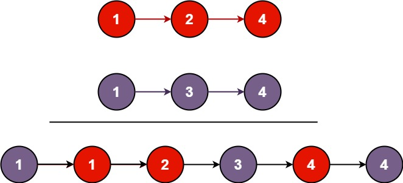

| title                  | cr_date                              | labels     | updated                              |
| ---------------------- | ------------------------------------ | ---------- | ------------------------------------ |
| Merge Two Sorted Lists | 2021年 01月 27日 星期三 22:45:35 CST | LinkedList | 2021年 01月 27日 星期三 22:45:35 CST |

## Leetcode

[linked-list](https://leetcode.com/explore/learn/card/linked-list/213/conclusion/1227/)  

## Question

Merge two sorted linked lists and return it as a **sorted** list. The list should be made by splicing together the nodes of the first two lists.

 

**Example 1:**



```
Input: l1 = [1,2,4], l2 = [1,3,4]
Output: [1,1,2,3,4,4]
```

**Example 2:**

```
Input: l1 = [], l2 = []
Output: []
```

**Example 3:**

```
Input: l1 = [], l2 = [0]
Output: [0]
```

 

**Constraints:**

- The number of nodes in both lists is in the range `[0, 50]`.
- `-100 <= Node.val <= 100`
- Both `l1` and `l2` are sorted in **non-decreasing** order.


## 解题思路

本题思路比较简单，构建一个新的dummyHead节点，然后遍历两个链表，对每个节点进行比大小，较小的那个插入到dummyHead节点的后面，当某一个链表到达末尾，则结束循环，然后把另一个链表插入到新链表末尾。


## Java Code

```java
/**
 * Definition for singly-linked list.
 * public class ListNode {
 *     int val;
 *     ListNode next;
 *     ListNode() {}
 *     ListNode(int val) { this.val = val; }
 *     ListNode(int val, ListNode next) { this.val = val; this.next = next; }
 * }
 */
class Solution {
    public ListNode mergeTwoLists(ListNode l1, ListNode l2) {
        ListNode head1 = l1;
        ListNode head2 = l2;
        if(head1 == null) return head2;
        if(head2 == null) return head1;
        ListNode newHead = new ListNode(0);
        ListNode dummyNode = newHead;
        while(head1 != null && head2 != null){
            if(head1.val <= head2.val){
                dummyNode.next = head1;
                head1 = head1.next;
            }else{
                dummyNode.next = head2;
                head2 = head2.next;
            }
            dummyNode = dummyNode.next;
        }
        if(head1 != null) dummyNode.next = head1;
        if(head2 != null) dummyNode.next = head2;
        return newHead.next;
        
    }
}
```


